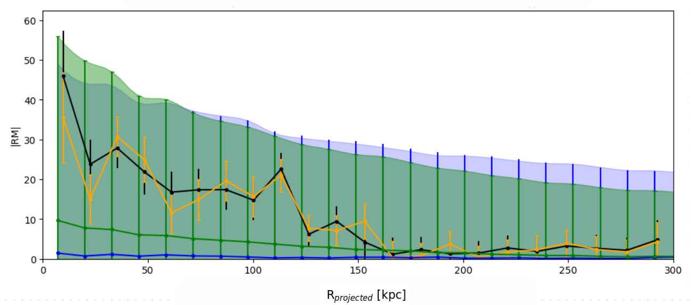
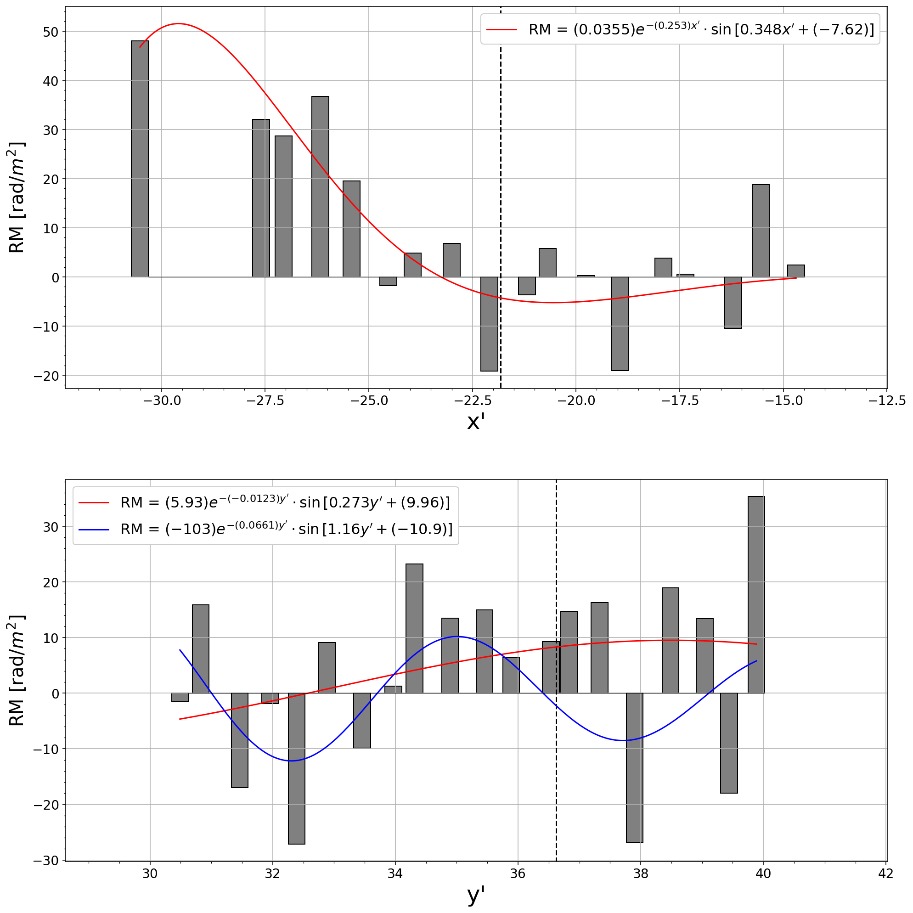

# Rotation Measures in the CGM of Andromeda

## main.py
Contains global variables and functions that are referenced by other scripts. Extracts Rotation MEasures from the catalog and defines most functions that can be used to manipulate and analyze the data when called in subsequent scripts.

## Uniform_distribution_simulation.py
The script generates random sky positions and plots them on 3D spheres from various viewing angles. It uses histograms for RA and Dec to evaluate the uniformity of the point distributions.

  
  

## M31_signal_vs_entire_sky.py
To explore the significance of Andromeda's Rotation Measure (RM) signal, random virial radii analogous to those of M31 were plotted. This analysis aimed to assess whether the RM values observed in Andromeda stood out against the backdrop of typical virial radii. By comparing these random samples, the potential implications for the magneto-ionized plasma surrounding the galaxy were evaluated.

  

## RM_vs_M31_radius.py
The standard error of the mean was calculated for the Rotation Measure (RM) data of M31, allowing error bars to be represented in the plot. The change in RM around the circumgalactic medium (CGM) was illustrated over a radial projection from M31, with distinct colors used to differentiate between the RM values within the CGM and the background RM values. The boundary of the virial radius was marked by a red dotted line, while the mean RM per bin was represented by the black line, which was analyzed across up to 22 bins.

  

## polar_plots.py
The data related to the Andromeda Galaxy (M31) and its surroundings was processed. Visualizations of Rotation Measure (RM) values were generated over various projections, highlighting the regions around M31 and its satellite galaxy, M33. Additionally, background regions were filled with specified radial distances, and the major and minor axes of M31 were plotted, enhancing the analysis of the galactic environment.

  

## RM_smoothing.py
The value of sigma_detect_limit was adjusted to modify the smoothing results of the data. A FITS file was opened, and the WCS projection was set up to visualize the angular resolution of the [BT04](https://www.aanda.org/articles/aa/abs/2004/14/aa0423/aa0423.html) data. Contours were added, and various celestial objects, including M31, M33, and AGN background coordinates, were plotted to enhance the analysis of the region.

All Rotation Measures within the CGM:
  

All rotation Measures above 5σ:
  

https://github.com/user-attachments/assets/e04d43d5-6698-4806-9138-72e06b3b844c

## dwarf_galaxies.py
The dwarf galaxy data was read from a CSV file and converted for proper unit handling. A function was defined to analyze dwarf galaxy statistics within a specified radius, calculating angular separations and mean values of rotation measures after background subtraction, with results being pickled for efficient storage and later retrieval.

  
  
  

## near_m31_new_axis_patch.py
The FITS file was opened, and data was extracted for the Andromeda Galaxy (M31). A WCS projection was set up, and contours were added to a figure to visualize HI density and dampening effects on the RM field. Scatter plots were created for positive and negative RM values, and various features, such as arrows and labels, were incorporated to enhance the representation of the galactic environment.

  

## RM_Damping.py
The data was initially separated to facilitate a more detailed analysis of the Rotation Measure (RM) values, but it was later combined for comprehensive evaluation. The analysis aimed to characterize the dampening effect of neutral hydrogen (HI) on the RM. Binned scatter plots and bar plots were generated, illustrating the RM values against their transformed coordinates.

  
  

https://github.com/user-attachments/assets/fdebbf1f-3694-4e0f-83a6-3c78e5ba97e3

## HI_density_correlation.py
A scatter plot of Rotation Measure (RM) versus column density was created, illustrating the correlation between the neutral hydrogen (HI) column density logarithm and RM values. A blue line represented the maximum correlation threshold, while its reflection at RM -25 rad m² indicated the minimum threshold. Sensitivity limits for WSRT, HIPASS, and GBT were depicted with dotted lines, and filled regions highlighted areas of significant detection above these limits.

  
